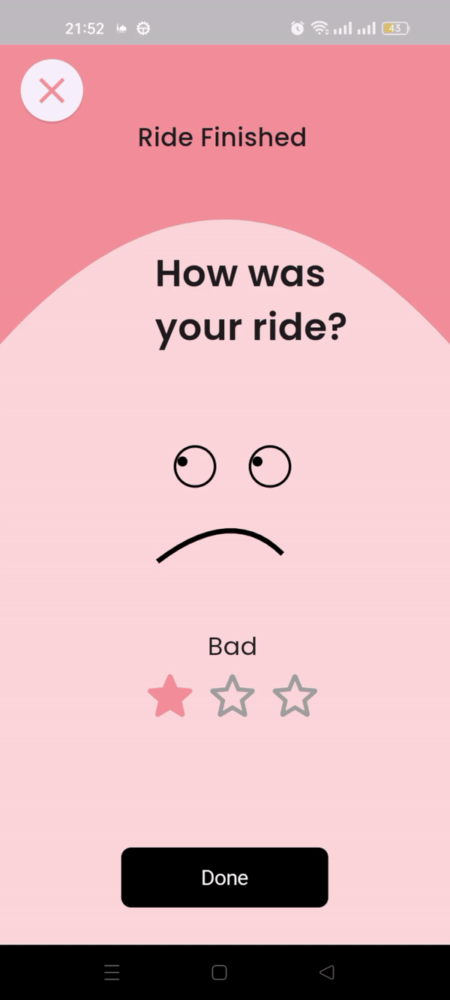

# Star Rating System in Flutter

This project implements a star rating system using Flutter and GetX for state management. The star rating replaces the traditional slider to provide a more intuitive user experience for rating.

## Features

- **Animated Face Reaction**: The face reacts based on the rating given.
- **Star Rating Widget**: Allows users to rate from 1 to 3 stars.
- **GetX for State Management**: Efficiently manages the state of the application.

## Screenshot



## Installation

1. **Clone the repository**:
    ```bash
    git clone https://github.com/your-repo/flutter-star-rating.git
    cd flutter-star-rating
    ```

2. **Install dependencies**:
    ```bash
    flutter pub get
    ```

3. **Run the app**:
    ```bash
    flutter run
    ```

## Usage

### 1. Add GetX to Your Project

Make sure you have GetX added to your `pubspec.yaml`:

```yaml
dependencies:
  flutter:
    sdk: flutter
  get: ^4.3.8
  google_fonts: ^2.1.0
